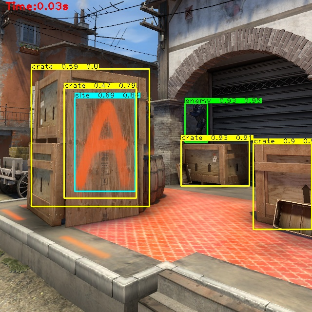

# CS:GO Object Detection using YOLOv5
Clone yolov5 project and install required packages

`git clone https://github.com/ultralytics/yolov5`  
`cd yolov5`  
`pip install -r requirements.txt`

# Dataset
Feel free to explore it here:
https://drive.google.com/drive/folders/1qsz45_LiRjRpqTOBSIbX8WMv_nyb7gRJ

Manually upload it or use the following command to download it: 

`wget https://drive.google.com/file/d/1bqLrs6bXsBlDR19qPI0EaLsdPxG8gSyV/view?usp=sharing`  
`unzip csgo_data.zip`

# Configuration 
If you want to use a different dataset
- Modify the csgo.yaml file 
- Modify yolov5s-c.yaml file (only change nc)

# Project Files
- copy cfg/yolov5s-c.yaml to yolov5/models/ directory
- copy cfg/csgo.yaml to yolov5/data/ directory
- copy test.py to yolov5 main directory

# Train
To train the model on CS:GO dataset, run the following command:

`
python train.py --img 640 --batch 16 --epochs 600 --data data/csgo.yaml --weights '' --cfg yolov5s-c.yaml`  

Feel free to change -epochs, and -batch size, if you want to use a pretrained model, change --weights.

# Test 
test.py is a custom implemented detection script to show IoU on test images, you can use YoloV5's test methods if you do not need IoU.

## Setup
- Create a directory to save test output to (For an example test_out in yolov5 directory)
- Copy cs_weights.pt to main directory of yolov5 (Ignore this if you want to use your trained model)

## Run
To test the model on CS:GO dataset, run the following command:

`python test.py --data data/csgo.yaml --weights cs_weights.pt --dist test_out/`  

## Output Example

